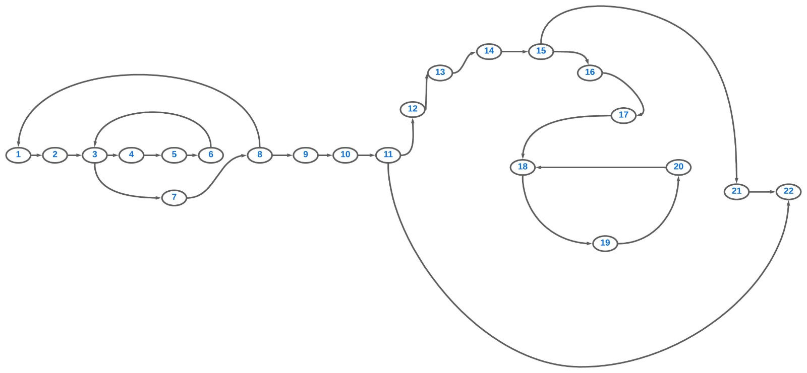

## CaixaBrancaLogin
## Etapa2  Critérios de Caixa Branca - (Grafo de Fluxo; Complexidade Ciclomática; Base de Caminhos)
1 - Numeração do código:

2 - Grafico de Fluxo:

3 - cálculo da complexidade ciclomática: 

V(G) = E – N + 2 > V(G) = 25 - 22 + 2 > V(G) = 5

4 - Cada uma das sequencias:

CAMINHO 1 - 1,2,3,4,5,6,3,7,8,1
CAMINH0 2 - 1,2,3,4,5,6,3,7,8,9,10,11,22
CAMINHO 3 - 1,2,3,4,5,6,3,7,8,9,10,11,12,13,14,15,21,22
CAMINHO 4 - 1,2,3,4,5,6,3,7,8,9,10,11,12,13,14,15,17,18,19,20,18

## 05/10/2023
